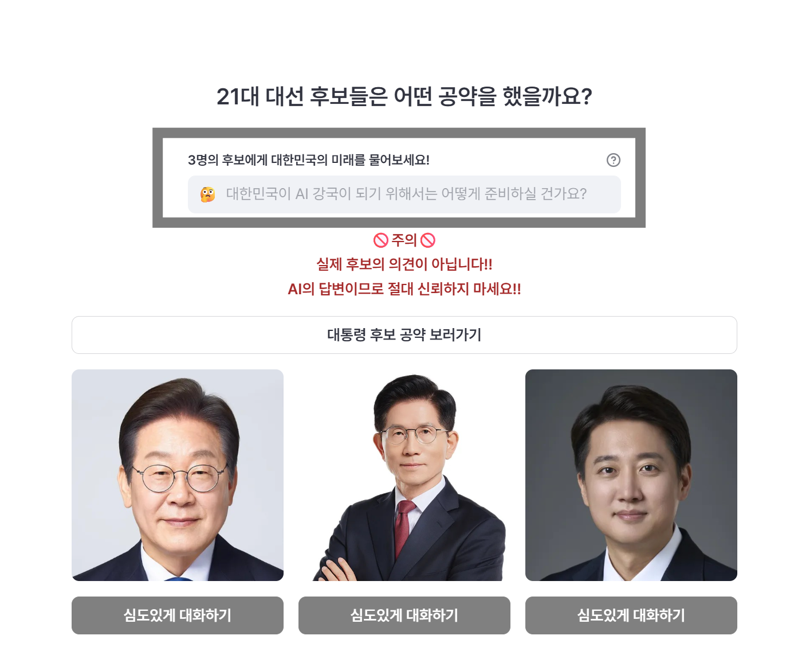
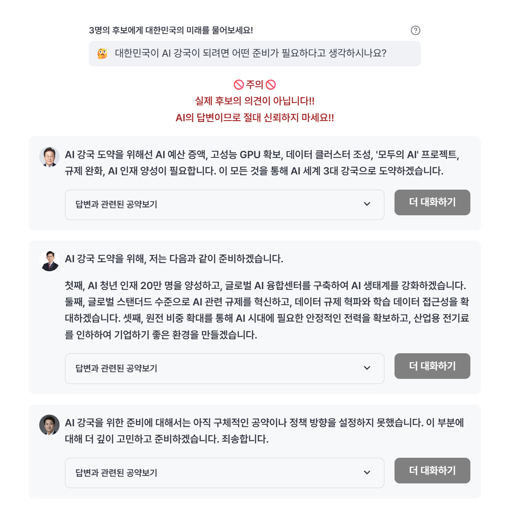
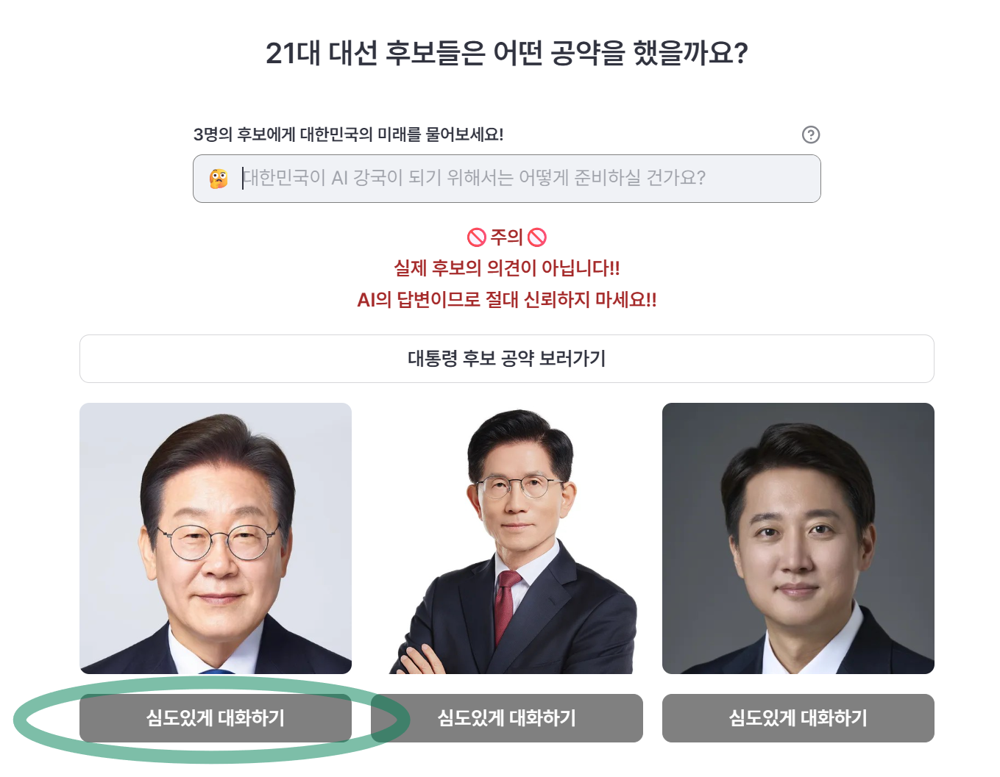
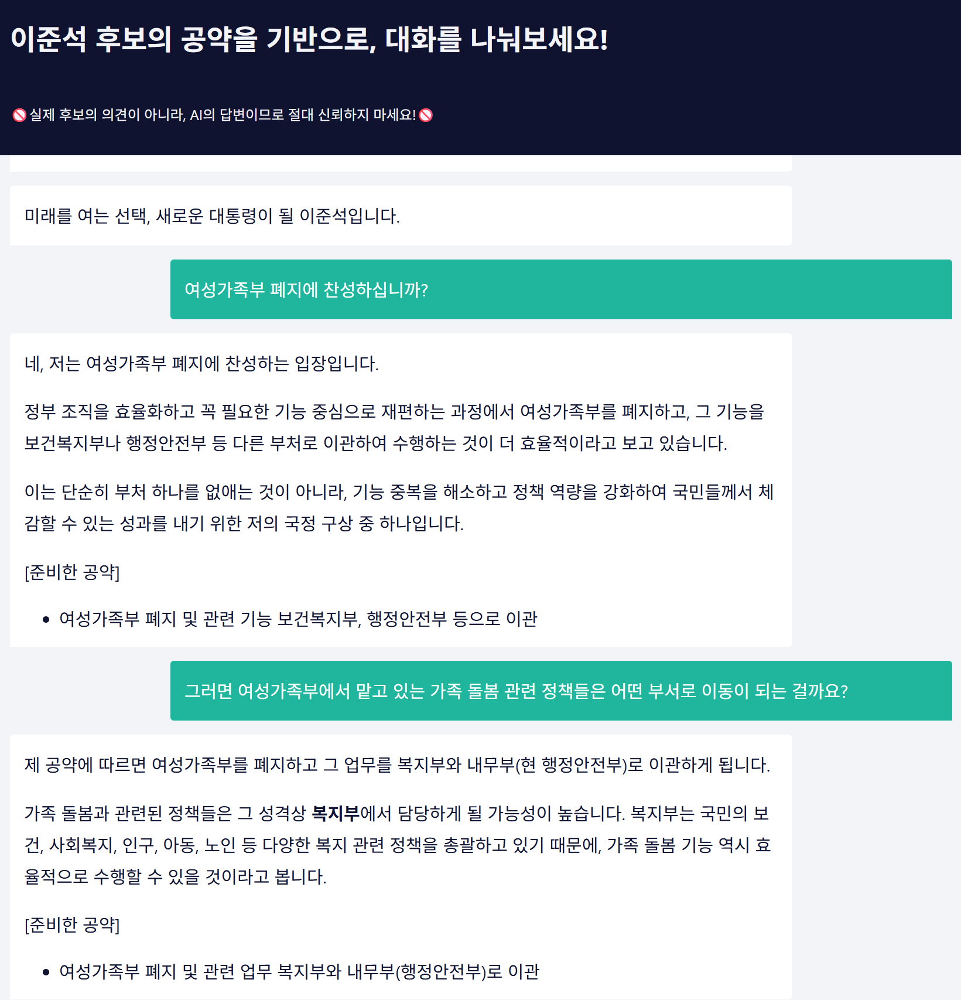

# 대한민국의 미래를 AI와 함께 알아보자!
https://korea-21-presidential-election.streamlit.app/  
최근, 21대 대통령 선거에 앞서, 대선 토론을 상당히 흥미롭게 시청했습니다.  
거기서 떠오른 아이디어가, 공약을 기반으로 각 후보를 하나의 Agent로 구성하여 
1) 질문에 대해, 어떤 공약을 준비했는지
2) 직접 심도있게 대화를 나누면 어떻게 의견을 제시할지
기능을 구현해보고자 만들게 되었습니다.

# 활용 기술
- Model : gemini-1.5-flash / gemini-2.5.flash-preview(tool calling 용)
- 외부 서비스 연결 : n8n

# 사용설명서
## 1. 동일 질문, 색다른 시각
앞으로의 미래에 대해 현재 겪고 있는 의문점을 입력합니다. 해당 질문에 대해 각 후보들이 어떤 공약을 준비했고, 어떤 시각을 가지고 있는지 답변해드립니다!

## 2. 심도있게 파헤쳐보자
특정 후보Agent와 직접 대화를 해보며, 어떤 공약을 준비했고, 어떤 생각을 가지고 있는지 알 수 있는 기능입니다. 
- Agent에 Memory 기능을 부여하여, 멀티턴 기능을 담았습니다! 
- 네이버 검색 API를 Agent Tool 로 연결하여 공약으로만 답하기 어려운 질문에 대해서는 검색을 통해 답변하게끔 하였습니다.
(다만, gemini 무료 모델을 쓰다보니, gpt 보다 tool calling이 잘 안 되는 느낌인 것 같네요 🥲)

